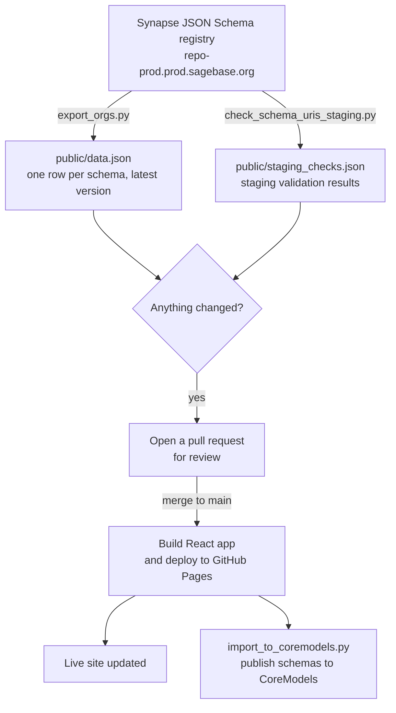

# Index of Data Models

A browsable index of **registered Synapse JSON schemas** across Sage Bionetworks, with
direct links to DCC data models, documentation, and portals.

**🔗 Live site: <https://sage-bionetworks.github.io/core-models/>**

The site rebuilds its data automatically every day from the Synapse JSON Schema registry, but
it does **not** publish itself: the automation opens a pull request that a maintainer has to
**merge each day** for the live site to update. If you just want to *find a schema*, start at the
live site. If you're the person responsible for keeping the site current, see
[For the repository maintainer](#for-the-repository-maintainer-merge-the-daily-update-pr) below.
If you maintain the pipeline itself, see [CONTRIBUTING.md](CONTRIBUTING.md).

---

## Contents

- [What you can do here](#what-you-can-do-here)
- [For data managers](#for-data-managers)
- [For the repository maintainer: merge the daily update PR](#for-the-repository-maintainer-merge-the-daily-update-pr)
- [How the data stays up to date](#how-the-data-stays-up-to-date)
- [Schema statuses](#schema-statuses)
- [What a schema URI looks like](#what-a-schema-uri-looks-like)
- [Repository structure](#repository-structure)
- [Running the site locally](#running-the-site-locally)
- [Data reference](#data-reference-datajson)
- [Maintenance & contributing](#maintenance--contributing)

---

## What you can do here

The live site has three tabs:

| Tab | What it shows |
| --- | --- |
| **Registered Schemas** | Every JSON schema registered in the Synapse schema registry — one row per schema, at its latest version. Search, filter by organization / schema / version / status, sort, pin favorites, view the raw JSON, and export to CSV or Excel. |
| **DCC Links** | A hand-curated table of Data Coordinating Centers (ARK, ADKP, ALS, Classic, ELITE, HTAN2, MC2, NF) linking straight to each one's GitHub data model, JSON schemas, documentation site, and Synapse portal. |
| **Insights** | Summary statistics across all registered schemas — counts by organization, status, and activity over time. |

You can also **Open in CoreModels** (top-right) to explore the published schemas in the
[CoreModels](https://go.coremodels.io) platform.

---

## For data managers

Common things you'll want to do, and how:

- **Find a schema** — Use the search box on the *Registered Schemas* tab (press `/` to jump to
  it), or open **Filters** for per-column dropdowns (organization, schema name, version,
  status). By default drafts are hidden; toggle **Hide drafts** to show them.

- **Get a schema's identifier for a downstream tool** — Click **Copy URI** on any row (or open
  the row's detail panel). This copies the fully-qualified identifier in the form
  `organizationName-schemaName-semanticVersion`, which is exactly what Synapse and downstream
  tooling expect. See [What a schema URI looks like](#what-a-schema-uri-looks-like).

- **Inspect a schema** — Click the `{ }` button to view the raw registered JSON, or click a row
  to open a detail panel with its identity, provenance (who created it and when), staging-check
  result, and a properties browser.

- **Build a metadata manifest** — In a row's detail panel, click **Download Template (.xlsx)**.
  This generates a spreadsheet with one column per property, dropdown validation for enumerated
  fields, and reference sheets listing every property and allowed value.

- **Export the list you're looking at** — Use **↓ CSV** or **↓ Excel** in the toolbar. The
  export respects your current filters and includes the composed schema URI.

- **Confirm a schema is deployable** — The ✓ / ✗ in the *Staging* column shows whether the
  schema resolved successfully in the Synapse **staging** registry during the last automated
  check. Click it for details. See [Schema statuses](#schema-statuses).

---

## For the repository maintainer: merge the daily update PR

**The live site only updates when you merge the automated pull request. This is a manual,
daily task — please do it every working day.**

Every day at **06:00 UTC** the automation re-exports the schema data from Synapse. If anything
changed, it opens a single pull request titled **"chore: automated schema data update"**. That PR
sits and waits for a human — nothing reaches the public site until you merge it. If you skip a day,
the live site simply keeps showing yesterday's data until the next PR is merged.

### Do this each day

1. Go to the repository's **[Pull requests](https://github.com/Sage-Bionetworks/core-models/pulls)**
   tab.
2. Look for an open PR named **"chore: automated schema data update"** from the
   `github-actions[bot]` (branch `automated/schema-update-…`).
   - **No such PR?** Then nothing changed today — there is nothing to do. ✅
3. Open the PR and glance at the **Files changed** tab to see which schemas moved (it only touches
   `public/data.json` and `public/staging_checks.json`).
4. Click **Merge pull request** → **Confirm merge**. (You can delete the branch afterward when
   prompted — it's optional and safe.)
5. Merging into `main` automatically rebuilds the React app, deploys it to GitHub Pages, and
   publishes the schemas to CoreModels. Give it a few minutes, then confirm the
   **[live site](https://sage-bionetworks.github.io/core-models/)** reflects the update.

That's the whole job: **check for the PR once a day and merge it.**

### Watch how it's done

A short screen recording of the merge, start to finish:

<video src="https://raw.githubusercontent.com/Sage-Bionetworks/core-models/main/docs/how-to-merge-pr.mp4" controls width="720"></video>

> If the player above doesn't load (some Markdown viewers don't embed video), download or open the
> recording directly: [`docs/how-to-merge-pr.mp4`](docs/how-to-merge-pr.mp4).

> **Why isn't this automatic?** Branch protection on `main` blocks direct pushes, and the PR is a
> deliberate safety gate — it lets you see exactly which schemas changed before the public site and
> CoreModels are updated. See [How the data stays up to date](#how-the-data-stays-up-to-date) for
> the full pipeline.

---

## How the data stays up to date

A single scheduled GitHub Actions workflow
([`.github/workflows/update-data.yml`](.github/workflows/update-data.yml)) keeps everything
current. It runs **every day at 06:00 UTC**, and can also be triggered manually from the
Actions tab (optionally scoped to one organization).



In plain terms:

1. **Export** — `export_orgs.py` reads every organization and schema from the Synapse registry
   and writes the latest version of each to `public/data.json`.
2. **Validate** — `check_schema_uris_staging.py` checks that each published schema URI resolves
   in the Synapse *staging* registry and records the result in `public/staging_checks.json`.
3. **Review** — Because direct pushes to `main` are blocked, any changes are collected onto a
   run-scoped branch and submitted as a **pull request** (`chore: automated schema data
   update`). A human merges it.
4. **Deploy** — Merging to `main` rebuilds the React app and deploys it to GitHub Pages, so the
   live site reflects the new data.
5. **Publish** — Published schemas are imported into CoreModels via its API.

> **Why a PR instead of an instant update?** The review step is a safety gate: a maintainer can
> see exactly which schemas changed before the public site and CoreModels are updated.

A second, manual-only workflow
([`check-staging-synapseclient-develop.yml`](.github/workflows/check-staging-synapseclient-develop.yml))
runs the same staging check against the *development* build of the Synapse Python client. It's a
pre-release smoke test — it never touches the site or the committed data.

---

## Schema statuses

Every schema row carries two independent signals:

**Status — `published` vs `draft`**
Set during export based on the schema's organization. A curated allow-list of production
organizations (e.g. `MC2Center`, `org.synapse.nf`, `HTAN2Organization`, `sage.schemas.ad`,
`sage.schemas.elite`, `NAMhub`, `org.synapse.classic`) is marked **published**; everything else
is **draft**. Only **published** schemas are pushed to CoreModels and validated against staging.
The live site hides drafts by default. *(To change which organizations count as published, edit
`PUBLISHED_ORGS` in `scripts/export_orgs.py` — see [CONTRIBUTING.md](CONTRIBUTING.md).)*

**Staging check — ✓ / ✗**
Whether the schema URI resolved in the Synapse staging registry during the last automated run.
This is a health check, separate from publish status.

---

## What a schema URI looks like

Synapse identifies a registered schema by an `$id` of the form:

```
organizationName-schemaName-semanticVersion
```

For example:

```
org.synapse.nf-researchToolsClinicalAssessmentTool-2.0.1
```

which resolves at:

```
https://repo-prod.prod.sagebase.org/repo/v1/schema/type/registered/org.synapse.nf-researchToolsClinicalAssessmentTool-2.0.1
```

Some schemas are registered **without** a semantic version. Those use just
`organizationName-schemaName` (no trailing `-version`), and the site shows a `—` in the Version
column. The **Copy URI** button always produces the correct form for you.

---

## Repository structure

```
core-models/
├── index.html                  # Vite entry point (loads the React app)
├── package.json                # dependencies and scripts
├── vite.config.js              # build config (base path, public/ as static dir)
│
├── src/                        # React single-page app
│   ├── main.jsx  App.jsx       # entry + top-level tabs
│   ├── components/             # SchemaTable, DCCTable, StatsPage, SchemaDetailPanel, …
│   ├── data/dcc.js             # the curated DCC Links table
│   ├── hooks/                  # e.g. pinned-schemas state
│   ├── utils/                  # date formatting, Excel/CSV export helpers
│   └── index.css               # styles
│
├── public/                     # web-served static assets (Vite publicDir)
│   ├── data.json               # GENERATED — one row per registered schema
│   └── staging_checks.json     # GENERATED — staging validation results
│
├── scripts/                    # data pipeline (Python) — run by GitHub Actions
│   ├── export_orgs.py          # registry  → public/data.json
│   ├── check_schema_uris_staging.py   # validate URIs on staging → staging_checks.json
│   └── import_to_coremodels.py # public/data.json → CoreModels (published only)
│
├── archive/
│   └── legacy-standalone.html  # superseded pre-React page, kept for reference
│
├── .github/
│   ├── workflows/
│   │   ├── update-data.yml      # daily: export → validate → PR → deploy → publish
│   │   └── check-staging-synapseclient-develop.yml   # manual pre-release check
│   └── CODEOWNERS
│
├── README.md                   # this file
└── CONTRIBUTING.md             # maintainer / pipeline guide
```

> **`public/` vs `scripts/`** — `public/` holds only the data the website serves; the Python
> pipeline lives in `scripts/` so it is no longer copied to the deployed site. `public/data.json`
> and `public/staging_checks.json` are **generated** by the pipeline — don't edit them by hand.
> `dist/` (build output) and `.env` (local secrets) are git-ignored.

---

## Running the site locally

Requires Node.js 20+.

```bash
npm install
npm run dev        # start the dev server (hot reload)
```

Then open the printed local URL. The app loads `public/data.json` and `public/staging_checks.json`
directly, so it works fully offline with whatever data is committed.

```bash
npm run build      # production build into dist/
npm run preview    # serve the production build locally
```

You do **not** need Synapse or CoreModels credentials to run the site — those are only used by
the data pipeline (see [CONTRIBUTING.md](CONTRIBUTING.md)).

---

## Data reference (`data.json`)

Each row in `public/data.json` describes one schema at its latest version:

| Field | Description |
| --- | --- |
| `organization_id` | Synapse numeric ID of the organization |
| `organization_name` | Organization name (first part of the URI) |
| `schema_id` | Synapse numeric ID of the schema |
| `schema_name` | Schema name (second part of the URI) |
| `version_id` | Synapse numeric ID of this specific version |
| `semantic_version` | `x.y.z` version, or `null` if registered without one |
| `created_on` | ISO-8601 timestamp of the latest version |
| `created_by` | Synapse user ID of the creator |
| `json_sha256_hex` | SHA-256 of the schema body (used to skip unchanged schemas) |
| `status` | `published` or `draft` (see [Schema statuses](#schema-statuses)) |

`staging_checks.json` has the shape `{ "checked_at": <ISO timestamp>, "results": { "<org>-<schema>": { "ok": true } | { "ok": false, "error": "…" } } }`.

---

## Maintenance & contributing

Editing the pipeline, changing which organizations are "published", adding a DCC link, adjusting
the schedule, or rotating credentials? See **[CONTRIBUTING.md](CONTRIBUTING.md)** for a full
walkthrough of the scripts, workflows, and required GitHub secrets.

Repository owner: see [`.github/CODEOWNERS`](.github/CODEOWNERS).
